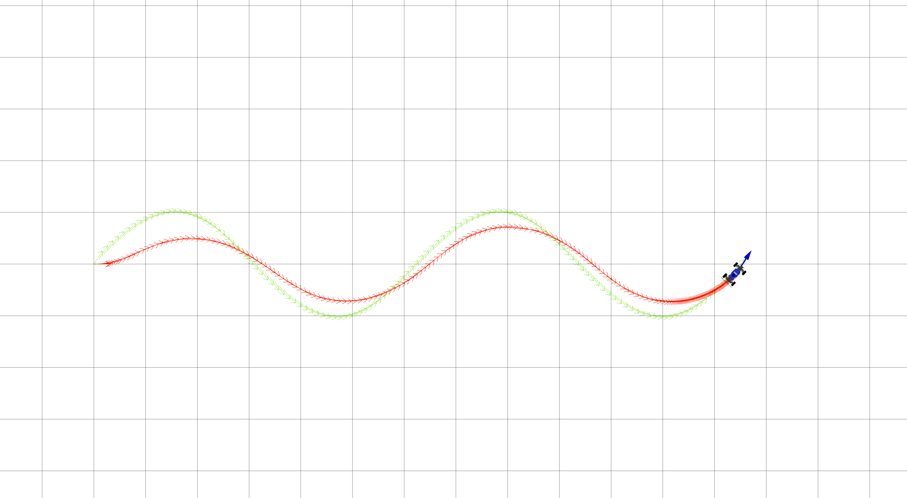

# Project 3: Control 

Replace this with your own writeup! Please place all figures in this directory.

1. When changing the parameter Kp, if we decrease the value, the car turned too early when it sensed the reference path would turn (this was on the wave reference path). If we increased the  parameter Kp, it would turn later after seeing where the reference path would turn. So, we had to change the value to make sure it didn't turn too early or late in an effort to match the path perfectly

2. Like we said above, changing Kp was based around making sure that Kp would turn at the right time it was supposed to, as opposed to too early or too late. We tried different values till we got the hang of it, then settled on 0.6. When changing Kd, we noticed how changing it made the car make long curves versus short ones, but they seemed to converge on the right path eventually, thought this could be a factor of the values we chose to experiment with. Thus, we just searched for the value that converged earliest.

3. If we increased the lookahead distance too far, the car looks up on the reference path too much to see where it should be, so it turns in too quickly rather than following the path it is supposed to to get to the right spot eventually. 

4. 
   
   When we make the lookahead distance too small, it doesn't preemptively turn ahead of time when the reference path starts to curve. So it will go straight past the turn then over correct to come back to the path. If we make the lookahead distance too large, it looks too far ahead to see where it should be, and goes straight there. Essentially, if you put the distance just right, it could right from the start reference the end point as where it should be, and go straight to the point rather than follow the wave path.

5. When the radius was large, given example being 5, the car performed just fine, following the path just as well as the standard radius circle. If it was too small, with the value of 0.5 given, the car couldn't physically turn that sharp, so it made a circle as close as it could and ended in the same place, but was too big.

6. The parameter tuning was more luck than anything actually. We used educated gusses to get a decent understanding of what sort of values K and T were, and they worked fine. K we felt should be a decent number of 10, because we realized how if the number was too small, the car wouldn't be able to choose from many angles to drive on. For T, we noticed how if it was too small, the car didn't turn sharp enough to avoid the circles in the slalom, but too big and it would overshoot. The saw path was so difficult because it is all sharp angles on the reference path, so it is impossible for the car to get on the reference path perfectly; it has to overshoot and come back over time.
   
   
   

7. 
   

8. Having a cost on how fast the car goes on each plot would be a good one, the faster it is, the quicker it will possibly reach its destination so it would be upweighted.

9. The MPC controller was best of course when it came to avoiding obstacles. The PID controller worked best wit the wave path, other controllers would have an issue getting on the line perfectly initially. With a high speed on the wave path, the PP controller worked best.

10. 
