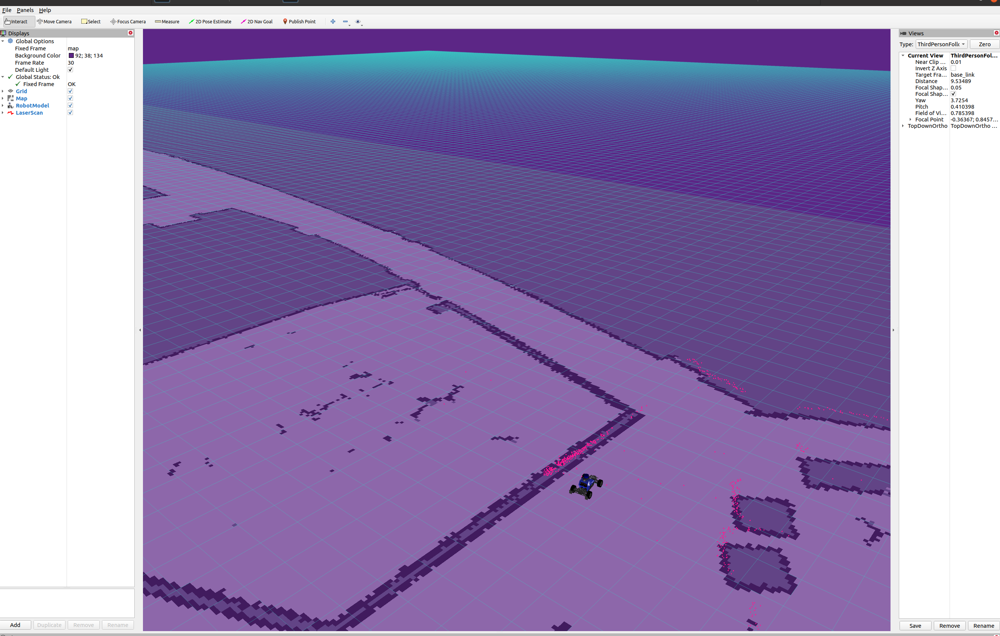
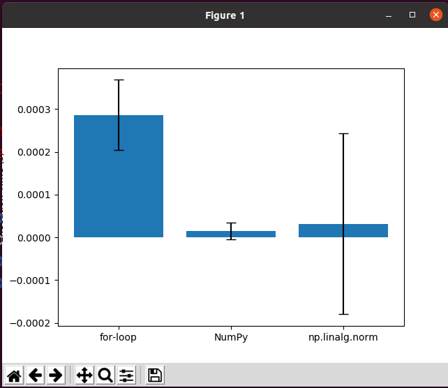
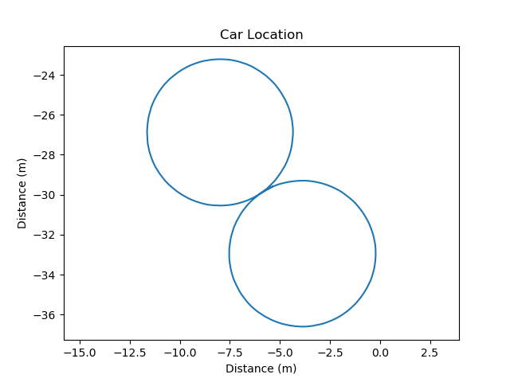
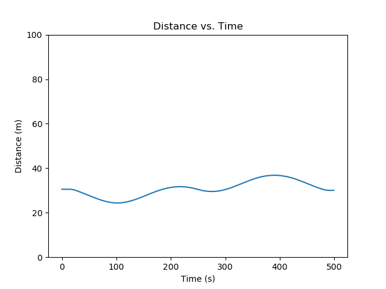
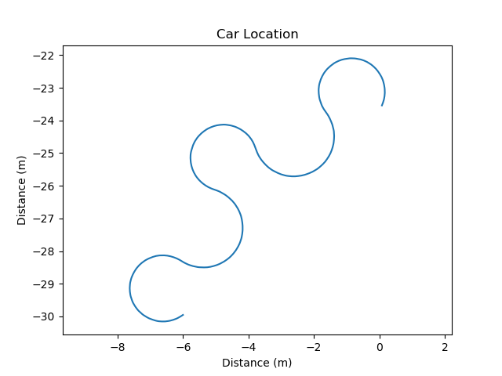
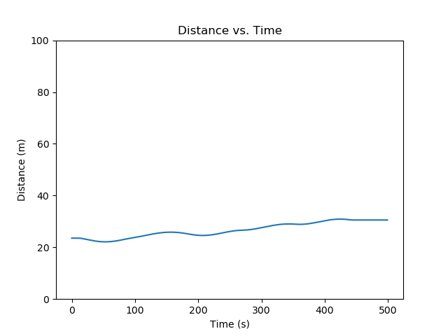

# Project 1: Introduction 

Replace this with your own writeup!

1. Define in your own words what a node, topic, publisher, and subscriber are and how they relate to each other.

   A node is a individualized, seperate "chunk" of code that processes data in its own way, without worrying about what is going on
   outside of its little world. What a node needs to function and what a node computes can be transmitted to other nodes via ROS 
   communication

   A topic is like a Slack channel. Just like different teams have different Slack channels, nodes communicate via different topics.
   For Slack, this allows only appropriate/relevant information to be put on the right channels rather than having everything dumped
   onto one channel and forcing everyone to pick up all the messages and filter which ones they need themselves. Topics are the same
   way, different nodes will make and read messages onto only the channels they need so they don't have to look at every message

   A publisher is an object that allows nodes to push messages they've made to a channel they want to broadcast it on. One publisher
   is made to write onto one channel, and once made, a node can just push messages with it

   A subscriber is an object that allows nodes to read messages from a channel. One subscriber is made to read from one channel, and
   once made, a node can read any messages on the channel. After a message is recieved, it can be broken down by the node for relevant
   information.
   

2. What is the purpose of a launch file?
   
   A launch file is used to specify to a computer how nodes should be started up/launched. This  potentially allows us to start up and 
   configure many nodes at once, as well as a master. 

3. Include the RViz screenshot showing the new map.

   

4. Include your runtime _ comparison.png figure for the different norm implementations.

   

5. Include the locations.png and distances.png figures for the plan figure _ 8.txt.

   

   

6. Include the locations.png and distances.png figures for the plan tight _ figure _ 8.txt.

   

   

