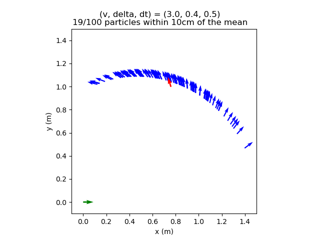
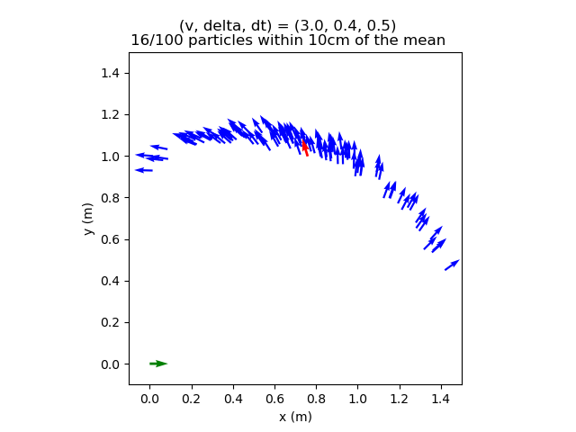
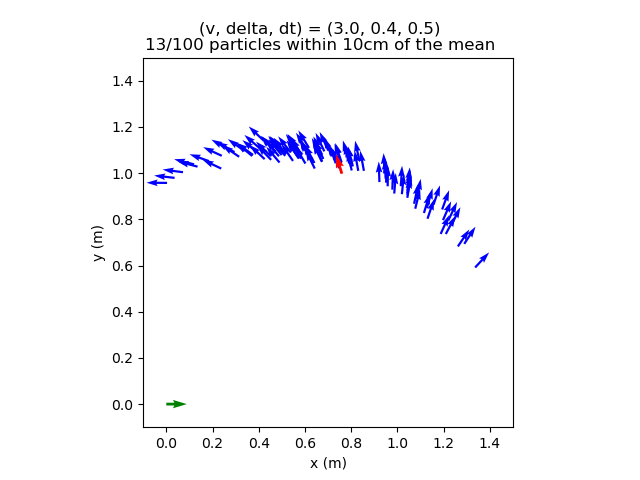
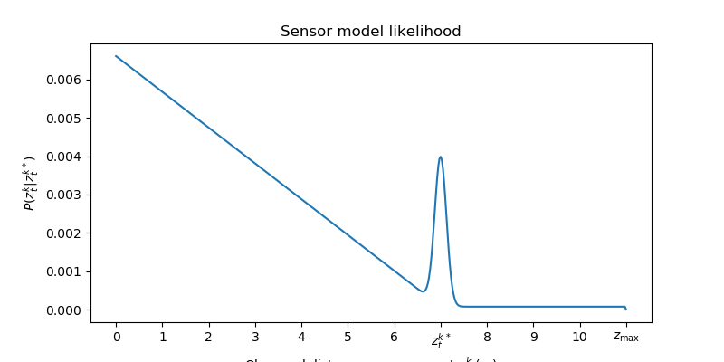
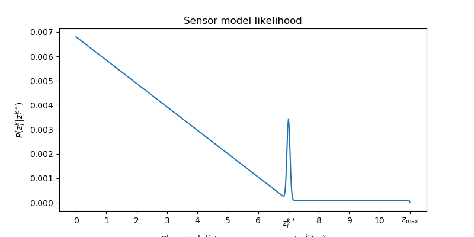
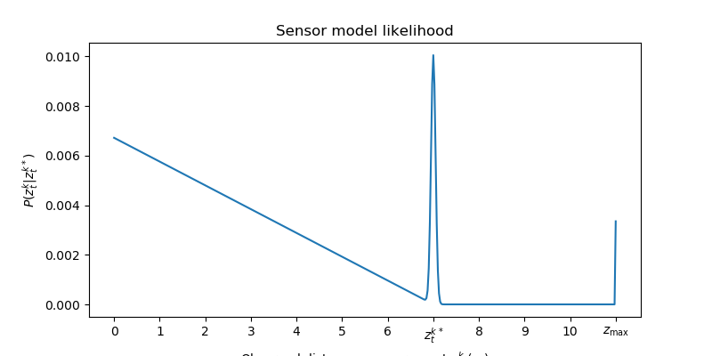
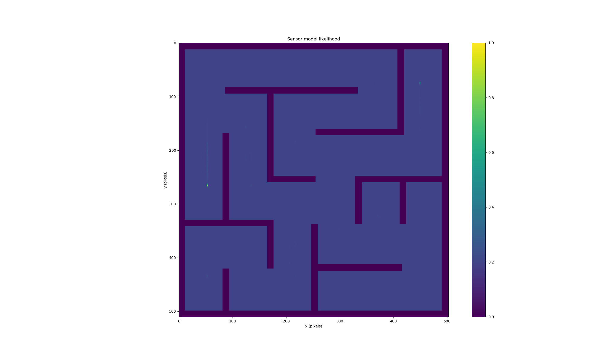
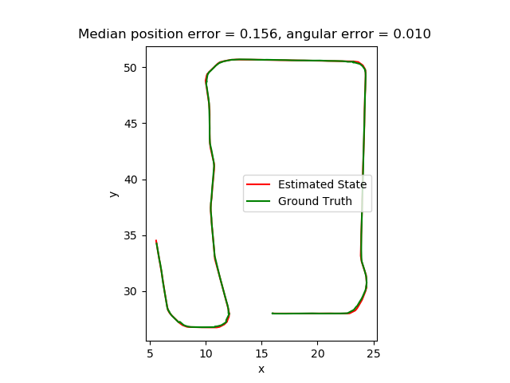

# Project 2: Localization 

Replace this with your own writeup! Please place all figures in this directory.

1. Noise is minimal after moving only slightly from the initial state in Figure 2, so the model is more confident about particles being in the immediate 10 cm radius. In Figure 3, the movement path was larger, and so the additional noise compounds to create a wider distribution of particles. 
2. 

   Here, in mm1, our motion\_params were (0.0, 0.1, 0.0, 0.0, 0.0). The curve was too smooth, all particles lay on the same path - we need the particles to be more offset and varied from the path. For mm\_2, we increased standard deviation uniformly to get more variance.

   

   Our motion\_params were (0.05, 0.1, 0.01, 0.01, 0.01). The particles here were too spread out on the x-axis, with too many particles on the right side in particular. We overcompensated and the particles were too offset from the reference path, and so, for mm3, we decreased theta\_std to lower the spread of particles along the arc.

   

   In mm3, our final tuned motion\_params were (0.05, 0.1, 0.01, 0.01, 0.0).
3. Independent laser scans ignore correlated measurements. For example, multiple lasers hiting one big object and reflecting back can't be interpreted as one uniform obstacle due to their independence, which does not take into full consideration the context from our state and map. Our implementation mitigates this by adding noise for sources of stochasticity, such as local measurement noise, unexpected objects, sensor failures, and random measurements.
4. 

   Our sensor\_params for sm1 were (5. 0.75, 0.05, 0, 0.5). On the sensor map, when our car was placed in the pentagon, the vertices were all equally bright, implying that there was a very high chance that the robot could be at each of the points. In order to make the model less confident about all these points, we lowered z\_hit drastically to lessen its effect on the final weighted probability but decreased hit\_std for each vertex to be more concentrated in probability and raised z\_rand slightly for sm2.

   

   Our sensor\_params for sm2 were (2, 0.25, 0.05, 0, 0.6). The vertices of the pentagon turned out less bright but more concentrated in where the robot thought they were located, which was good but each vertex was still equal and had no bias towards any one vertex, unlike figure 4. Additionally, some areas of the map were dimly lit, implying that the robot's estimated position wasn't even restricted to the pentagon anymore. To correct this, we raised z\_hit back to 0.75 and equalized the other three zs. This is in line with the given suggestion to weigh one z much higher than the other ones.

   

   Our final sensor\_params for sm3 were (2, 0.75, 0.05, 0.05, 0.05). Unlike the previous line plots, there was a larger spike at z\_max and a taller but thinner spike at z\_t^k\*.
5. 
6. 
